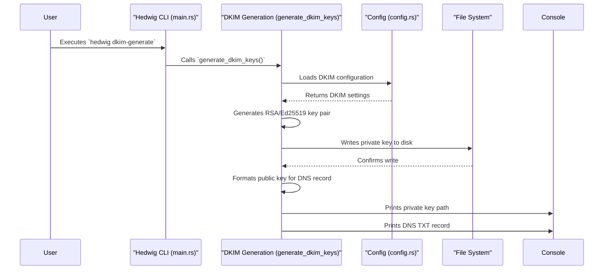

# Hedwig SMTP Server Architecture

This document outlines the architecture of the Hedwig SMTP server.

## Overview

The Hedwig SMTP server is a Rust application designed to receive, store, and process emails. It supports features like DKIM key generation, TLS encryption, configurable storage backends, and deferred email processing for retries.

The server can be run in two main modes:

1.  **Server Mode**: Starts the SMTP server to listen for incoming email.
2.  **DKIM Generate Mode**: Generates DKIM (DomainKeys Identified Mail) key pairs.

## Key Components

The application is structured around several key components:

### 1. Configuration (`config.rs`, `Cfg` struct)

- Loads server settings from a TOML file (e.g., `config.toml`).
- Includes settings for the server address, logging, TLS, DKIM, authentication, storage, and email processing (e.g., max retries).

### 2. Command Line Interface (CLI)

- Uses `clap` for parsing command-line arguments.
- Supports subcommands:
  - `server`: To run the SMTP server (default).
  - `dkim-generate`: To initiate DKIM key generation.

### 3. DKIM Key Generation (`generate_dkim_keys` and related functions)

- Triggered by the `dkim-generate` command.
- Supports RSA and Ed25519 key types.
- Generates a private key and saves it to a file specified in the configuration.
- Derives the public key and outputs the corresponding DNS TXT record for DKIM setup.

### 4. Main Server Application (`run_server` function in `main.rs`)

This is the core of the SMTP server and orchestrates various sub-components:

#### a. Logging

- Uses `tracing` for structured logging.
- Log level and format (plain/JSON) are configurable.
- Supports environment variable override for log level (`HEDWIG_LOG_LEVEL`).

#### b. Storage Subsystem (`storage` module, `Storage` trait, `FileSystemStorage`)

- Abstracted via a `Storage` trait.
- Currently implements `FileSystemStorage` for storing email messages and their status (e.g., `Queued`, `Sent`, `Failed`) on the local filesystem.
- The `get_storage_type` function initializes the configured storage backend.

#### c. TLS/Encryption

- Uses `tokio-rustls` and `rustls-pemfile` for TLS support.
- If configured, loads SSL/TLS certificates and private keys to enable encrypted connections (SMTPS).
- Handles TLS handshakes for incoming connections if TLS is enabled.

#### d. Authentication

- Basic authentication support is determined by the presence of `server.auth` configuration.
- The `SmtpServer` instance is initialized with an `auth_enabled` flag based on this.

#### e. Email Queuing and Processing

- Uses `async_channel` for an in-memory MPSC (multi-producer, single-consumer) queue for email jobs.
- When an email is received (via `callbacks`), a `Job` (containing the message ID) is sent to this channel.
- Upon startup, the server checks the storage for any previously queued emails and adds them to the processing channel.

#### f. SMTP Protocol Handling (`SmtpServer` from `smtp` crate, `callbacks::Callbacks`)

- The external `smtp` crate's `SmtpServer` handles the SMTP protocol details.
- Custom logic for handling different stages of an SMTP session (e.g., new mail, recipient, data) is implemented in `callbacks::Callbacks`.
- `Callbacks` interacts with:
  - The storage system (to save emails).
  - The email processing channel (to queue new emails).
  - The server configuration.

#### g. Deferred Task Worker (`worker::deferred_worker::DeferredWorker`)

- Runs in a separate Tokio task.
- Listens on the `receiver_channel` for jobs.
- Processes emails that might have failed previously and require retries.
- Interacts with the storage to update email status.
- Uses the `max_retries` configuration.

#### h. Network Listener and Connection Handling

- Uses `tokio::net::TcpListener` to bind to the configured IP address and port.
- Enters an asynchronous loop to accept incoming TCP connections.
- For each accepted connection:
  - A new Tokio task is spawned to handle the client.
  - If TLS is enabled, it attempts a TLS handshake.
  - The connection (potentially TLS-wrapped) is passed to `SmtpServer::handle_client` for SMTP protocol processing.

## Workflow / Data Flow

### DKIM Generation Flow

1.  User runs `hedwig dkim-generate`.
2.  `main` calls `generate_dkim_keys`.
3.  Configuration is loaded.
4.  Based on `dkim_config.key_type` (RSA or Ed25519):
    - A private/public key pair is generated.
    - The private key is written to the path specified in `dkim_config.private_key`.
    - The public key is formatted into a DNS TXT record string.
5.  The DNS record and private key path are printed to the console.



### Incoming Email Flow (Server Mode)

1.  User runs `hedwig server` (or just `hedwig`).
2.  `main` calls `run_server`.
3.  Configuration is loaded, logging is initialized.
4.  Storage, TLS (if configured), and email processing channels are initialized.
5.  The `DeferredWorker` is started in a background task.
6.  The server checks storage for any emails already in `Queued` status and sends them to the processing channel.
7.  The TCP listener starts accepting connections on the configured address.
8.  A client connects.
9.  A new task is spawned:
    a. If TLS is configured and this is an initial connection for SMTPS, a TLS handshake is performed.
    b. The (potentially encrypted) stream is passed to `SmtpServer::handle_client`.
10. The `SmtpServer` (from the `smtp` crate) interacts with the client, using `callbacks::Callbacks` for application-specific actions:
    a. During the `DATA` phase, if the email is accepted, `Callbacks` saves the email to the storage (e.g., as a file).
    b. `Callbacks` then creates a `Job` with the email's message ID and sends it to the `sender_channel`.
11. The `DeferredWorker` (or another worker consuming from this channel in the future) picks up the `Job` from `receiver_channel` for further processing (e.g., delivery attempts, DKIM signing if applicable before sending).

```mermaid
graph TD
    A[Client Connects] --> B{TLS Enabled?};
    B -- Yes --> C[TLS Handshake];
    B -- No --> D[Connection to SmtpServer];
    C --> D;

    D --> E[SmtpServer receives commands];
    E -- MAIL FROM, RCPT TO --> F[Callbacks: Validate Sender/Recipient];
    F -- DATA --> G[Callbacks: Start Email Data Reception];
    G --> H[Callbacks: Receives Email Content];
    H -- End of Data --> I[Callbacks: Save Email to Storage];
    I --> J[Storage: Email Saved (e.g., Queued status)];
    J --> K[Callbacks: Create Job (Message ID)];
    K --> L[Callbacks: Send Job to Async Channel];

    M[DeferredWorker] -- Listens --> L;
    M --> N[DeferredWorker: Receives Job];
    N --> O[DeferredWorker: Retrieve Email from Storage];
    O --> P[DeferredWorker: Process Email (e.g., delivery attempt)];
    P -- Success --> Q[Storage: Update Email Status (e.g., Sent)];
    P -- Retryable Failure --> R[Storage: Update Email Status (e.g., Queued, increment retry count)];
    R --> L;
    P -- Non-Retryable Failure --> S[Storage: Update Email Status (e.g., Failed)];

    T[Initial Server Startup] --> U[Load Queued Emails from Storage];
    U --> L;
```

## Modules

The `smtp-server/src` directory contains the following key Rust modules:

- **`main.rs`**: Entry point of the application, CLI parsing, initialization, and main server loop.
- **`config.rs`**: Defines structures for configuration and logic for loading it.
- **`storage/mod.rs`**: Defines the `Storage` trait and related types (like `Status`).
  - **`storage/fs_storage.rs`**: Implements the `Storage` trait using the file system.
- **`worker/mod.rs`**: Defines worker-related structures.
  - **`worker/deferred_worker.rs`**: Implements the worker responsible for processing deferred/queued email jobs.
- **`callbacks.rs`**: Implements the `SmtpCallbacks` trait from the `smtp` crate, handling the application-specific logic during an SMTP session.

This architecture allows for modularity and separation of concerns, making it easier to maintain and extend the server's functionality.
