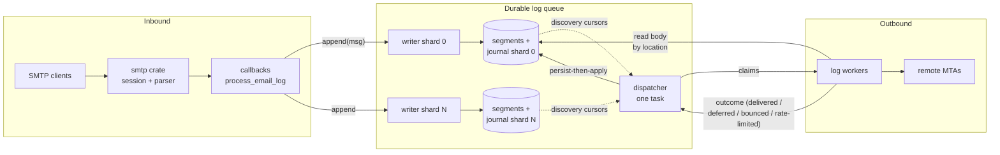
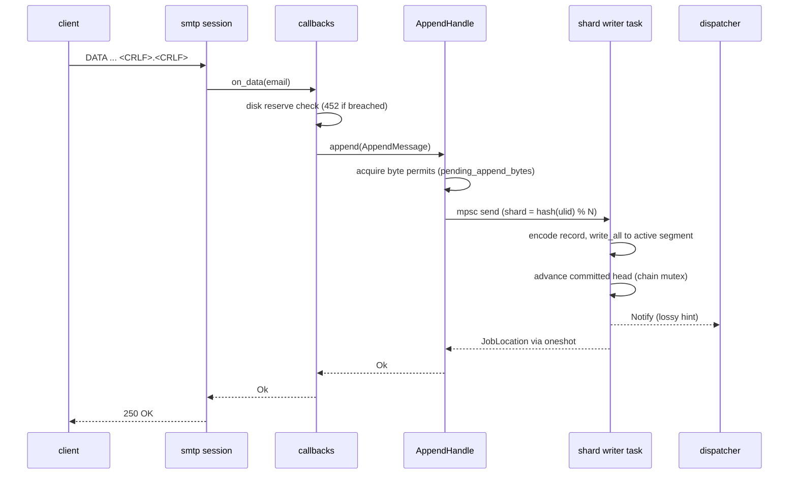
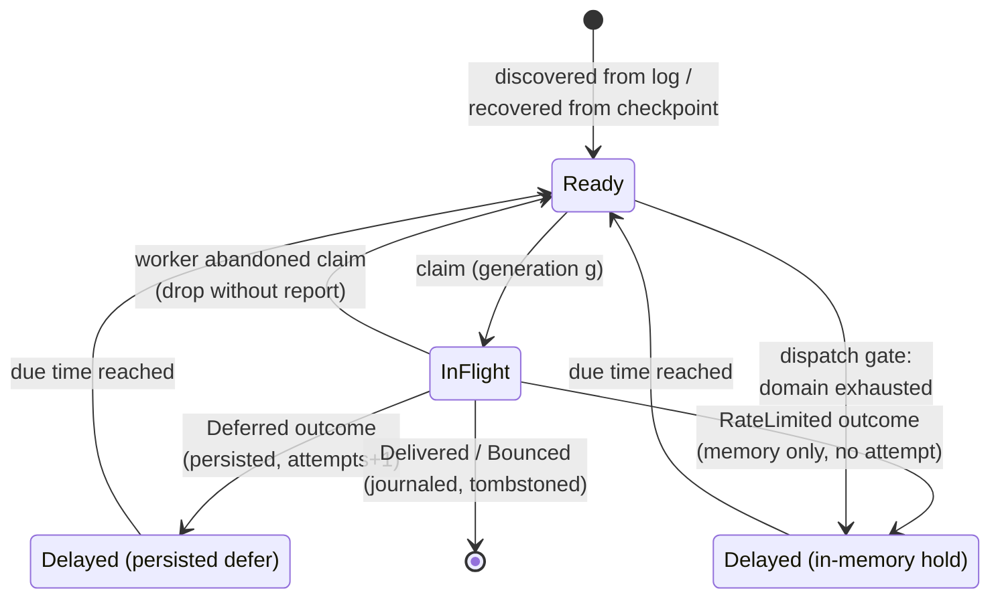
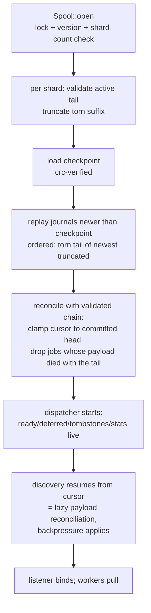
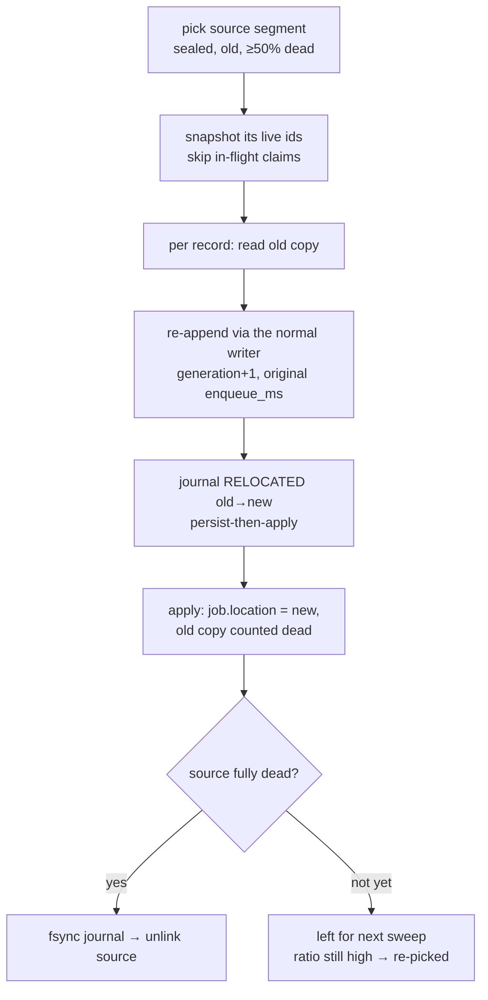

# Hedwig Architecture

> Covers the server as of the `log-queue` branch. The durable log queue is the
> default subject; the legacy filesystem path is described where it
> differs. Design rationale lives in [PLAN.md](PLAN.md); this document describes
> what is actually built and where.

## 1. The big picture

Hedwig is a single-process MTA in two crates:

- `smtp/` — the SMTP protocol library: session state machine, parser, TLS
  (implicit + STARTTLS), timeouts. It owns the wire; everything else is
  reached through the `SmtpCallbacks` trait.
- `smtp-server/` — the server: callbacks, queue storage, delivery workers,
  DKIM, MTA-STS, rate limiting, metrics, CLI.

The central idea of the log-queue design is **separating two rates that have
nothing to do with each other**:

- *Inbound* is bounded by how fast complete messages can be appended to disk.
- *Outbound* is bounded by DNS, remote MTAs, and politeness rate limits.

The durable log sits between them. Acceptance (`250 OK`) waits only for the
message to be written into the kernel page cache; delivery happens whenever
the outbound side gets to it.


```mermaid
flowchart LR
    subgraph inbound [Inbound]
        C[SMTP clients] --> L[smtp crate<br/>session + parser]
        L --> CB[callbacks<br/>process_email_log]
    end
    subgraph queue [Durable log queue]
        CB -->|"append(msg)"| W0[writer shard 0]
        CB -->|append| W1[writer shard N]
        W0 --> S0[(segments +<br/>journal shard 0)]
        W1 --> S1[(segments +<br/>journal shard N)]
        S0 & S1 -.->|discovery cursors| D[dispatcher<br/>one task]
    end
    subgraph outbound [Outbound]
        D -->|claims| LW[log workers]
        LW -->|read body<br/>by location| S0
        LW --> MX[remote MTAs]
        LW -->|"outcome (delivered /<br/>deferred / bounced / rate-limited)"| D
    end
    D -->|persist-then-apply| S0
```

With `storage_type = "fs"` the old path is used instead:
`storage.put()` → bounded `async_channel` → channel workers → periodic
deferred-directory scans. That path is untouched and is why the log queue is
a separate, selectable backend (`storage_type = "log"`).

Module map:

| Area | Files |
|---|---|
| Record format | `smtp-server/src/logqueue/record.rs` |
| Segments | `smtp-server/src/logqueue/segment.rs` |
| Shard/spool layout, lock | `smtp-server/src/logqueue/{shard,spool}.rs` |
| Append writers | `smtp-server/src/logqueue/writer.rs` |
| Journal + checkpoints | `smtp-server/src/logqueue/state.rs` |
| Dispatcher (scheduling, GC, compaction) | `smtp-server/src/logqueue/dispatcher.rs` |
| Delivery workers | `smtp-server/src/worker/{mod,log_worker}.rs` |
| Acceptance path | `smtp-server/src/callbacks.rs` (`process_email_log`) |
| Wiring & shutdown | `smtp-server/src/main.rs` |
| Operator CLI, migration | `smtp-server/src/{queue_cli,migrate}.rs` |

## 2. On-disk layout

```text
<base_path>/
  bounced/                     # bounce archive (legacy fs format, retention-cleaned)
  spool/
    format-version             # "1"
    .lock                      # exclusive flock, held for the server's lifetime
    shard-0000/
      segment-000000000007.log   # sealed payload segments (immutable)
      segment-000000000009.log
      segment-000000000010.open  # the one active append target
      journal-000000000003.log   # state journal (current)
      checkpoint                 # latest checkpoint (atomic rename)
    shard-0001/ ...
```

Rules the layout encodes:

- One shard per append writer; a shard is owned by exactly one writer task.
- At most one `.open` segment per shard. Sealing renames `.open → .log`;
  sealed segments are immutable forever.
- Segment ordinals are never reused; the active segment always has the
  shard's highest ordinal.
- The number of files is proportional to *live backlog + unreclaimed
  garbage*, never to historical volume — fully dead segments are unlinked.
- Changing `append_writers` requires an empty queue (checked at startup in
  `Spool::open`).

## 3. Payload record format

Records are self-framing and versioned (`record.rs`). Everything the
scheduler needs is in the header, so discovery never reads message bodies.

```text
offset  size  field
     0     4  magic "HWLQ"
     4     2  format version (=1)
     6     2  flags (reserved, zero)
     8     4  record_len    — total size; scanner skips to next record with this
    12     4  header_len    — body starts here
    16     4  header_crc    — crc32 over [0..16) ++ [20..header_len)
    20     4  payload_crc   — crc32 over body
    24    16  message id (binary ULID)
    40     8  enqueue timestamp (unix ms) — survives relocation, drives age metrics
    48     4  relocation generation       — bumped when compaction copies a record
    52     4  per-segment ordinal
    56   var  envelope: sender, recipient list (u16-length-prefixed strings)
     …   var  body (record_len - header_len bytes)
```

The two checksums serve different failures: `header_crc` catches torn or
corrupt headers during scans; `payload_crc` is verified on every body read so
bit rot in a sealed segment surfaces at delivery time, not silently.

**Tail policy** (`segment.rs`): on recovery the active segment is scanned
from 0; the first invalid position truncates the file (a torn tail is mail
that was never fully acknowledged, or falls inside the accepted power-loss
window). Corruption *inside a sealed segment* is a hard error, never a skip —
sealed data was durable and complete, so damage there means something is
wrong enough that a human should look.

## 4. Acceptance path (SMTP → disk)


```mermaid
sequenceDiagram
    participant C as client
    participant S as smtp session
    participant CB as callbacks
    participant AH as AppendHandle
    participant W as shard writer task
    participant DI as dispatcher

    C->>S: DATA ... <CRLF>.<CRLF>
    S->>CB: on_data(email)
    CB->>CB: disk reserve check (452 if breached)
    CB->>AH: append(AppendMessage)
    AH->>AH: acquire byte permits (pending_append_bytes)
    AH->>W: mpsc send (shard = hash(ulid) % N)
    W->>W: encode record, write_all to active segment
    W->>W: advance committed head (chain mutex)
    W-->>DI: Notify (lossy hint)
    W-->>AH: JobLocation via oneshot
    AH-->>CB: Ok
    CB-->>S: Ok
    S-->>C: 250 OK
```

Key properties (`writer.rs`):

- **Admission is byte-bounded, not count-bounded.** A tokio semaphore sized
  by `pending_append_bytes` is acquired for the encoded record size before
  queueing; it frees once the bytes reach the page cache. This is real
  backpressure against disk throughput, never against outbound speed.
- **Publish ordering per record:** write → advance committed head → notify →
  complete the SMTP future. The committed head can never expose a partial
  record, so concurrent readers below the head are always safe.
- **Rotation is seal-first.** When a record would overflow
  `segment_target_bytes`: seal (rename) the active segment, *then* create the
  next one. A crash in between leaves zero `.open` files (recovery creates
  one); create-first could leave two, which is an unrecoverable layout error.
  If the create fails, `active` becomes `None` and the next append retries it
  rather than ever writing into the sealed file.
- Writers run on `spawn_blocking` threads and own their files exclusively —
  no shared append offsets, no locks on the hot path except the tiny chain
  mutex.

What the writer publishes to the dispatcher is the **chain**: an ordered list
of `SegmentHead { segment, committed, sealed }`, last entry = active. The
chain is authoritative; the `Notify` is an optimization that may be lost or
coalesced — a 500ms safety tick re-checks regardless.

## 5. Dispatcher: one task, all scheduling

The dispatcher (`dispatcher.rs`) is a single tokio task owning every
scheduling structure. Nothing else mutates them, which is what makes the
claim/outcome protocol race-free without fine-grained locking.

```text
Dispatcher state
├── jobs: HashMap<MessageId, Job>          # location, attempts, remaining rcpts, state
├── ready: BinaryHeap<(enqueue_ms, id)>    # oldest-first dispatch order
├── delayed: BinaryHeap<(due_ms, id)>      # deferred retries + rate-limit holds
├── waiting: VecDeque<ClaimWaiter>         # parked workers wanting work
└── per shard:
    ├── cursor (segment, offset)           # next undiscovered position
    ├── tombstones: segment -> {ids}       # terminal records, filter for re-scans
    ├── stats: segment -> {total/dead bytes}  # GC accounting
    └── ShardStateStore                    # journal + checkpoint writer
```

### 5.1 Discovery

On a notify or the safety tick, each shard's cursor is advanced through the
chain: read headers from `cursor` to the committed head, register unknown
message ids as `Ready`, hop to the next chain entry when a sealed segment is
exhausted (pruning consumed entries). Two filters apply during the scan:

- ids tombstoned in that segment are skipped (they went terminal after a
  checkpoint but before this re-scan);
- an id that is already tracked but appears with a **higher relocation
  generation** is a compaction copy whose journal entry was lost in a crash —
  the dispatcher re-journals the relocation so the accounting becomes durable.

**Backpressure:** discovery stops while `jobs` holds `max_tracked_jobs`
(100k) entries. The log itself holds everything beyond the window, so memory
is bounded by config while the backlog is bounded only by disk. This applies
during recovery too — a million-message backlog does not OOM the process.

### 5.2 Job lifecycle


```mermaid
stateDiagram-v2
    [*] --> Ready: discovered from log /<br/>recovered from checkpoint
    Ready --> InFlight: claim (generation g)
    InFlight --> Ready: worker abandoned claim<br/>(drop without report)
    InFlight --> Delayed_p: Deferred outcome<br/>(persisted, attempts+1)
    InFlight --> Delayed_m: RateLimited outcome<br/>(memory only, no attempt)
    Ready --> Delayed_m: dispatch gate:<br/>domain exhausted
    Delayed_p --> Ready: due time reached
    Delayed_m --> Ready: due time reached
    InFlight --> [*]: Delivered / Bounced<br/>(journaled, tombstoned)

    Delayed_p: Delayed (persisted defer)
    Delayed_m: Delayed (in-memory hold)
```

Workers pull with `DispatcherHandle::claim()`. A claim carries a
monotonically increasing **generation**; outcomes and abandonments quote it,
and anything stale is ignored — a hung worker's late report can never clobber
a reassigned job. Dropping a `Claim` without reporting sends an abandonment
(via its `Drop` impl), so a panicking worker returns its job to `Ready`
automatically; a claim can never leak.

The job a worker receives is payload-free: id, location, attempts, sender,
remaining recipients. The body is read separately by position
(`read_body`), with its checksum verified on every read.

### 5.3 Rate limiting: gate + acquire

Two checks share one token-bucket `RateLimiter`:

1. **Dispatch gate** (dispatcher, `peek_sync`): non-consuming. If the first
   remaining recipient's domain has no tokens, the job goes to the in-memory
   delay heap instead of wasting a worker slot. A due time is not a token
   reservation — the job re-passes the gate when it wakes, which prevents a
   thundering herd on one domain.
2. **Worker acquire** (`check_rate_limit`): consuming, immediately before
   transmission — the authoritative check. Losing this race reports
   `RateLimited`, which requeues in memory only: **no attempt increment, no
   journal write**. Local throttling is not a delivery failure.

## 6. Persistent state: journal + checkpoint

A payload record implies `Ready` unless superseded — so acceptance costs one
write, not two. Everything that changes afterwards is an entry in the shard's
state journal (`state.rs`):

```text
DEFERRED  { id, location, attempts, next_attempt_ms, remaining_recipients, last_error }
DELIVERED { id, location, timestamp }
BOUNCED   { id, location, timestamp, reason }
RELOCATED { id, old_location, new_location }        # written by compaction
```

Entries are `[len][crc][payload]`-framed; the journal uses the same
page-cache durability as payloads, and the same torn-tail truncation policy.

**Persist-then-apply** is the ordering rule everywhere: the dispatcher writes
the journal entry first and mutates its in-memory state only after the write
succeeds. A failed write parks the entry in a retry queue with the job left
in-flight — a job is never marked terminal, and never dropped from
scheduling, on the strength of an unpersisted transition.

### 6.1 Checkpoints

Journals would grow forever, so once a shard writes
`checkpoint_interval_bytes` of journal it snapshots. A checkpoint is
**self-sufficient for every segment still on disk**; without that, deleting
journal history could resurrect delivered mail (payload implies Ready!). It
contains: terminal tombstones per live segment, the discovered ready set
(with attempts *and remaining recipients*), the deferred set, per-segment GC
stats, the discovery cursor, and the journal position it covers.

The write sequence keeps the dispatcher unblocked and the disk safe:

```text
1. fsync current journal            # nothing covered may be less durable than the checkpoint
2. rotate: start journal N+1        # entries during the snapshot land after the cut
3. snapshot in-memory state         # cheap, synchronous
4. spawn_blocking:
     write checkpoint.tmp -> fsync -> rename -> fsync dir
5. on success: delete journals <= N # the only place journal history dies
```

A crash anywhere before step 5 is safe: the old checkpoint plus the complete
journal chain reproduces the same state. Step 5 is a *destructive boundary*,
which is why steps 1 and 4 fsync (see §8).

### 6.2 Recovery


```mermaid
flowchart TD
    A[Spool::open<br/>lock + version + shard-count check] --> B[per shard: validate active tail<br/>truncate torn suffix]
    B --> C[load checkpoint<br/>crc-verified]
    C --> D[replay journals newer than checkpoint<br/>ordered; torn tail of newest truncated]
    D --> E[reconcile with validated chain:<br/>clamp cursor to committed head,<br/>drop jobs whose payload died with the tail]
    E --> F[dispatcher starts:<br/>ready/deferred/tombstones/stats live]
    F --> G[discovery resumes from cursor<br/>= lazy payload reconciliation,<br/>backpressure applies]
    G --> H[listener binds; workers pull]
```

Restart semantics: terminal stays terminal; deferred keeps attempts, due
time, and remaining recipients; everything else — including jobs that were
in-flight at the crash — becomes ready and is redispatched (at-least-once).
There is no "feed the whole backlog through a channel" step; startup cost is
checkpoint size + journal delta, not queue depth.

Two guards worth knowing: journals must form a contiguous chain starting at
the checkpoint's position (or ordinal 1 when there is no checkpoint) — a gap
is a hard error, because silently lost journal history can resurrect
delivered mail. And recovery scans always use the *format's* maximum record
size, not the configured one, so lowering `max_message_size` can never make
previously accepted mail look corrupt.

## 7. Delivery (workers)

`LogWorker::run` is a pull loop: `claim() → read_body() → process_claim() →
report(outcome)`. `Worker::process_claim` (in `worker/mod.rs`) shares the
per-recipient delivery core with the legacy path (`deliver_recipient`: MX
lookup, MTA-STS policy, transport attempts, outcome classification) but
differs deliberately:

- **Per-recipient accounting.** Delivered recipients leave the remaining
  set; only transiently-failed ones are retried. A partial multi-recipient
  failure re-sends only to recipients that have not accepted the message
  (the remaining set is persisted in the DEFERRED entry and survives
  restarts and checkpoints).
- **No sleeping in worker slots.** The legacy path sleeps on rate limits
  inside the worker; the log path reports and moves on.
- **Retry budget**: `attempts >= max_retries` bounces terminally.
- **Bounce archive**: before reporting `Bounced`, the message is written to
  `<base_path>/bounced/` in the legacy one-file format, so operators keep the
  same inspection workflow and `[storage.cleanup]` retention applies.
  Archive failure is logged but never blocks the bounce.

Backoff is `60s × 2^attempts`, capped at 24h — same curve as the legacy
deferred worker, but scheduled by the dispatcher's due-time heap instead of a
30-second directory scan.

## 8. GC, compaction, and the durability model

### 8.1 Reclamation

Per-segment accounting is byte-based: `total_bytes` (known once sealed — it
is the file length) and `dead_bytes` (accumulated as records go terminal or
get relocated; tombstone sets make it idempotent).

- **Deletion** is event-driven: the terminal transition that makes
  `dead_bytes == total_bytes` deletes the segment immediately (fsync journal
  → unlink → drop tombstones/stats/reader → remove from chain). A tick-driven
  sweep backstops the one miss window (a segment whose last record dies
  before the dispatcher observed its seal). At high delivery rates this is
  the dominant path: burst segments die whole and are unlinked without any
  copying.
- **Compaction** handles segments pinned by long-deferred stragglers: sealed,
  past `compaction_min_age`, `dead_ratio ≥ compaction_dead_ratio` (default
  0.5, ≈2× amplification bound), fully below the discovery cursor. One runs
  at a time, driven in small batches from the dispatcher tick.


```mermaid
flowchart TD
    A[pick source segment<br/>sealed, old, ≥50% dead] --> B[snapshot its live ids<br/>skip in-flight claims]
    B --> C[per record: read old copy]
    C --> D[re-append via the normal writer<br/>generation+1, original enqueue_ms]
    D --> E[journal RELOCATED old→new<br/>persist-then-apply]
    E --> F[apply: job.location = new,<br/>old copy counted dead]
    F --> G{source fully dead?}
    G -- yes --> H[fsync journal → unlink source]
    G -- not yet --> I[left for next sweep<br/>ratio still high → re-picked]
```

Because relocated copies flow through the ordinary append path they are
discovered like new records; the relocation generation resolves every
"which copy wins" question, including after a crash that leaves both copies
on disk. In-flight records are skipped rather than relocated, which is what
makes stale-read refetch protocols unnecessary: a segment is only ever
unlinked when nothing live — and therefore nothing readable — remains in it.
A terminal outcome racing the copy cannot resurrect the message: the ordered
journal replay marks whichever copy lost as garbage.

### 8.2 What is durable when

| Event | Guarantee |
|---|---|
| Process crash / SIGKILL | Nothing acknowledged is lost. Page cache survives the process; journals and segments replay. |
| Machine crash / power loss | Recently acknowledged mail (page cache not yet written back) may be lost. **Documented, accepted tradeoff** — this is why acceptance is fast. |
| Any crash, old queued mail | Never lost. Destructive operations (checkpoint truncation, segment deletion, compaction publication) fsync before removing anything, so power loss can only eat the recent write window, never history. |
| Remote accepted, crash before journal | The message is redelivered — at-least-once, duplicates possible, loss not. |

The rule of thumb encoded throughout: **fsync is reserved for the moments we
destroy something**; everything additive rides the page cache.

## 9. Startup, shutdown, config

`main.rs` branches on `storage_type == "log"`:

- Startup order: spool (lock lives until exit) → writers (tail validation) →
  per-shard state recovery → dispatcher → log workers → listeners. No replay
  channel; the deferred-scan worker is not spawned. The cleanup task runs
  with `deferred_retention` forcibly disabled so it can never eat an
  unmigrated legacy spool sitting at the same `base_path`.
- Shutdown: cancel token stops listeners → workers finish their current
  claims and exit when the dispatcher stops handing out work → dispatcher
  drains in-flight outcomes, persists them, checkpoints every shard → append
  admission closes last (pending appends flush) → spool lock releases.

Config (`[queue]`, all optional):

```toml
[queue]
append_writers = 1                 # shards; change requires an empty queue
pending_append_bytes = 134217728   # admission buffer bound (bytes, not msgs)
segment_target_bytes = 67108864    # seal threshold; must fit max_message_size
compaction_dead_ratio = 0.5
compaction_min_age = "60s"
disk_reserve_bytes = 1073741824    # 452-reject below this free space
checkpoint_interval_bytes = 8388608
```

## 10. Operator tooling

Binary segments are not `ls`-able, so the CLI is part of the design:

```sh
hedwig queue list  --spool <base>/spool     # live messages: state, age, attempts, due
hedwig queue show  --spool <base>/spool ID  # envelope, state history, location
hedwig queue stats --spool <base>/spool     # per-segment live/dead, ratios
hedwig queue migrate --config <cfg>         # one-time legacy fs-spool migration
```

`list/show/stats` are strictly read-only and safe against a live spool: they
take no lock, never truncate torn tails, and never create files. `migrate` is
restart-safe (idempotent by message-id dedup against the target spool),
preserves attempts/due-times/last-errors, verifies every record after the
writers flush, and then renames `queued/`/`deferred/` to timestamped
`.migrated-*` backups — it never deletes anything.

## 11. Measured behavior

Same machine, 1 KiB messages, 16 connections (see PLAN.md §27 for the full
plan; these are the two headline experiments):

| Scenario | fs backend | log backend |
|---|---|---|
| Outbound disabled (pure ingest, tmpfs) | 85–93k msg/s | 97–105k msg/s |
| Outbound via a 500 ms/message MTA, 64 workers | **117 msg/s** (p99 accept 548ms) | **170,411 msg/s** (p99 accept 0.28ms) |
| Outbound delivery rate in that test | ~121 msg/s | ~121 msg/s |

The second row is the design goal made visible: with slow outbound the legacy
bounded channel fills and acceptance collapses to the outbound drain rate,
while the log backend keeps accepting at disk speed (5.97M messages parked in
6.7 GiB) and delivers at exactly the same outbound rate. Sustained ingest
reclaims itself: a 30s full-throughput run writes ~3.5 GiB and ends with only
the active segment on disk.

## 12. Invariants (the list to check before changing anything)

1. The committed head never exposes a partial record.
2. A record never spans segments; the active segment has the shard's highest
   ordinal; `.open` files number 0 or 1 per shard.
3. Terminal or relocated state is applied in memory only after its journal
   entry is written (persist-then-apply).
4. Journal history is deleted only below a durable (fsynced + renamed)
   checkpoint; checkpoints are self-sufficient for every segment still on
   disk.
5. Segments are unlinked only when nothing live remains in them and the
   journal covering their deaths is fsynced.
6. Recovery scans use the format's absolute record bound, never the
   configured one.
7. Claims carry generations; a stale generation's outcome is ignored.
8. Rate-limit holds are never persisted and never count as attempts.
9. Relocation preserves message id and enqueue timestamp and bumps the
   generation; the highest valid generation wins everywhere.
10. Locations are always explicit (shard, segment, offset) — nothing may
    re-derive a shard from the current writer count.
