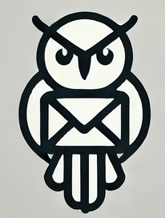

<div align="right">
  <a href="https://zerodha.tech">
    
  </a>
</div>

<div align="center">
  
  <h1>Hedwig</h1>
</div>

<p align="center">
  Hedwig - A high-performance, minimalist SMTP server implemented in Rust.
</p>

---

## Docs

Documentation lives at https://hedwig.sarat.dev

## Install (recommended)

Download the latest release binary from GitHub Releases:

```bash
curl -L -o hedwig.zip https://github.com/iamd3vil/hedwig/releases/download/v0.5.2/hedwig-v0.5.2-linux-x86_64.zip
unzip hedwig.zip
chmod +x hedwig
```

Checksums:

```
https://github.com/iamd3vil/hedwig/releases/download/v0.5.2/checksums.txt
```

## Build from source

```bash
git clone https://github.com/iamd3vil/hedwig.git
cd hedwig
cargo build --release
```

## License

AGPL v3. See `LICENSE`.
